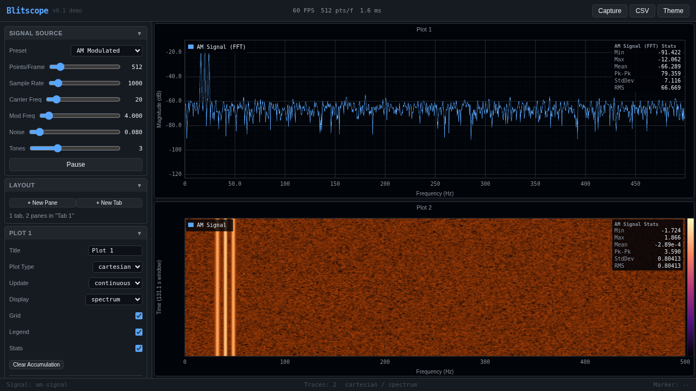

# Blitscope

Real-time signal visualization in the browser. No backend, no dependencies, no build step.



## Run

```bash
python3 -m http.server 8080
# open http://localhost:8080
```

## Features

**Plot types**: Cartesian, Scatter (XY), Polar

**Display modes**: Standard, Spectrum (live FFT), Persistence (phosphor decay), Spectrogram (waterfall), Gradient (intensity heatmap)

**Signal presets**: Sine+Noise, AM Modulated, Multi-Tone, Frequency Sweep, Lissajous, Noisy Sensor, Pulse Train, Chirp, Custom Formula

**Custom formula** supports `sin`, `cos`, `exp`, `sqrt`, `pow`, `square`, `sawtooth`, `triangle`, `sinc`, `noise()`, and all Math functions. Variables: `t` (seconds), `i` (index), `n` (points), `fs` (sample rate), `f` (carrier freq).

**Axis scaling**: Fixed, Windowed, Expand-only, Peak-decay, Symmetric-zero, Baseline-zero. Log scale supported.

**Layout**: Tabs with stacked panes inside each tab. Drag handles to resize panes.

**Markers**: Click to place, Shift+click for harmonic markers, right-click to clear.

**Derived traces**: Moving average, Max hold.

**Statistics**: Min, Max, Mean, Peak-to-Peak, StdDev, RMS (live overlay).

**Capture**: PNG screenshot, CSV export.

**Diagnostics**: Live FPS, draw time, dropped frame indicator.

**Theme**: Dark/light with browser preference detection.

## Architecture

15 vanilla JS ES module files, ~4k lines total. WebGL primary renderer with Canvas 2D auto-fallback. 60 FPS target. Zero external dependencies.

| File | Purpose |
|------|---------|
| `main.js` | Entry point, render loop, state |
| `state.js` | Default state, presets, constants |
| `signals.js` | Synthetic signal generators + custom formula |
| `fft.js` | Radix-2 FFT, windowing, magnitude spectrum |
| `analysis.js` | Moving average, max hold, statistics |
| `renderer.js` | WebGL shaders and rendering (all modes) |
| `canvas-renderer.js` | Canvas 2D fallback renderer |
| `overlay.js` | Grid, axes, labels, markers, stats overlay |
| `plot.js` | Plot panel (ties renderer + overlay + data) |
| `layout.js` | Tab/pane layout manager |
| `sidebar.js` | All sidebar UI controls |
| `capture.js` | PNG screenshot, CSV export |
| `theme.js` | Dark/light theme management |
| `style.css` | All styles, both themes |
| `index.html` | Shell |
